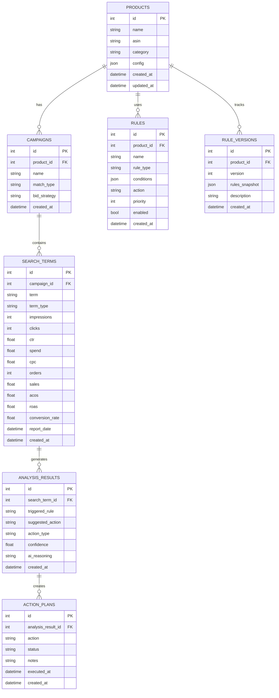
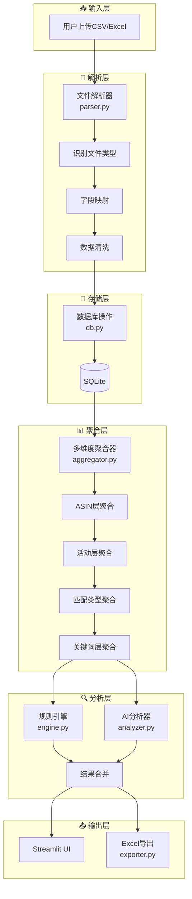
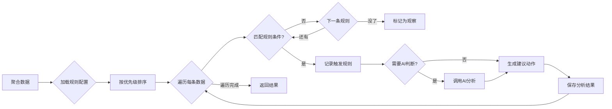
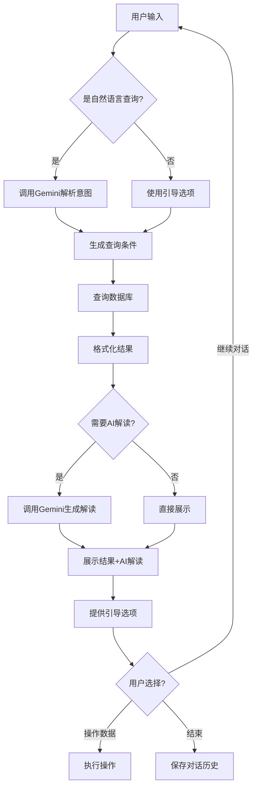

# 技术设计文档 (Design)
# AMZ搜索词分析系统

**版本**: 1.0.0
**创建日期**: 2026-01-10
**作者**: Jack Huang
**状态**: 已锁定

---

## 1. 技术栈

| 层级 | 技术选型 | 版本 | 选择理由 |
|------|----------|------|----------|
| 前端框架 | Streamlit | ≥1.40 | Python生态、快速原型、学习成本低 |
| 后端语言 | Python | 3.14 | 数据处理生态丰富、用户已安装 |
| 数据库 | SQLite | 内置 | 轻量、无需额外服务、本地存储 |
| AI服务 | Google Gemini | API | 用户指定、推理能力强 |
| 数据处理 | Pandas | ≥2.2 | CSV/Excel处理标准库 |
| Excel读写 | openpyxl | ≥3.1 | Excel格式支持 |
| 环境变量 | python-dotenv | ≥1.0 | 安全管理API Key |
| 测试框架 | pytest | ≥8.0 | Python标准测试框架 |
| 代码检查 | ruff | ≥0.4 | 快速、现代的linter |

**相关ADR**: [ADR-001: 技术栈选择](ADR/ADR-001-tech-stack.md)

---

## 2. 目录结构

```
AMZ搜索词分析系统/
├── .git/                       # Git版本控制
├── .gitignore                  # Git忽略配置
├── .env                        # 环境变量（不提交）
├── .env.example                # 环境变量模板
├── requirements.txt            # Python依赖
│
├── docs/                       # 📚 文档目录
│   ├── PRD.md                  # 产品需求文档
│   ├── Design.md               # 技术设计文档（本文件）
│   ├── Plan.md                 # 开发计划
│   ├── Task.md                 # 任务清单
│   └── ADR/                    # 架构决策记录
│       ├── ADR-001-tech-stack.md
│       ├── ADR-002-database.md
│       ├── ADR-003-ai-service.md
│       └── ADR-004-config-versioning.md
│
├── src/                        # 📦 源代码
│   ├── __init__.py
│   ├── app.py                  # Streamlit主入口
│   │
│   ├── config/                 # ⚙️ 配置模块
│   │   ├── __init__.py
│   │   ├── settings.py         # 应用配置
│   │   └── manager.py          # 配置版本管理
│   │
│   ├── data/                   # 📊 数据处理模块
│   │   ├── __init__.py
│   │   ├── parser.py           # 文件解析器
│   │   ├── db.py               # 数据库操作
│   │   ├── models.py           # 数据模型
│   │   └── aggregator.py       # 多维度聚合
│   │
│   ├── rules/                  # 📏 规则引擎模块
│   │   ├── __init__.py
│   │   ├── engine.py           # 规则引擎核心
│   │   ├── keyword_rules.py    # 关键词规则
│   │   └── asin_rules.py       # ASIN规则
│   │
│   ├── ai/                     # 🤖 AI分析模块
│   │   ├── __init__.py
│   │   ├── client.py           # Gemini API客户端
│   │   ├── analyzer.py         # AI分析器
│   │   └── chat.py             # AI对话助手
│   │
│   ├── export/                 # 📤 导出模块
│   │   ├── __init__.py
│   │   └── exporter.py         # 报告导出器
│   │
│   └── ui/                     # 🖥️ UI组件模块
│       ├── __init__.py
│       ├── components.py       # 通用组件
│       ├── pages/              # 页面目录
│       │   ├── __init__.py
│       │   ├── home.py         # 首页/仪表盘
│       │   ├── upload.py       # 文件上传
│       │   ├── analysis.py     # 搜索词分析
│       │   ├── actions.py      # 操作清单
│       │   └── settings.py     # 系统设置
│       └── sidebar.py          # AI助手侧边栏
│
├── data/                       # 💾 数据存储
│   ├── db/                     # SQLite数据库
│   │   └── app.db              # 主数据库（不提交）
│   └── uploads/                # 上传文件临时目录（不提交）
│
├── tests/                      # 🧪 测试目录
│   ├── __init__.py
│   ├── conftest.py             # pytest配置
│   ├── unit/                   # 单元测试
│   │   ├── __init__.py
│   │   ├── test_parser.py
│   │   ├── test_aggregator.py
│   │   ├── test_rules.py
│   │   └── test_exporter.py
│   └── integration/            # 集成测试
│       ├── __init__.py
│       └── test_workflow.py
│
├── README.md                   # 使用说明
├── CHANGELOG.md                # 变更日志
└── TROUBLESHOOTING.md          # 问题排查
```

---

## 3. 数据库模型

### 3.1 ER图



### 3.2 表结构详细说明

#### products（产品档案）
| 字段 | 类型 | 说明 |
|------|------|------|
| id | INTEGER | 主键，自增 |
| name | TEXT | 产品名称 |
| asin | TEXT | 产品ASIN |
| category | TEXT | 产品类目 |
| config | JSON | 产品特定配置（核心关键词、相关性关键词等） |
| created_at | DATETIME | 创建时间 |
| updated_at | DATETIME | 更新时间 |

#### campaigns（广告活动）
| 字段 | 类型 | 说明 |
|------|------|------|
| id | INTEGER | 主键，自增 |
| product_id | INTEGER | 外键，关联products |
| name | TEXT | 活动名称（如BLK-TP01-LOT01-SP自动紧密固定-1.88bid） |
| match_type | TEXT | 匹配类型（close-match/loose-match/substitutes/complements） |
| bid_strategy | TEXT | 竞价策略（固定/动态提高/动态降低） |
| created_at | DATETIME | 创建时间 |

#### search_terms（搜索词明细）
| 字段 | 类型 | 说明 |
|------|------|------|
| id | INTEGER | 主键，自增 |
| campaign_id | INTEGER | 外键，关联campaigns |
| term | TEXT | 搜索词或ASIN |
| term_type | TEXT | 类型（keyword/asin） |
| impressions | INTEGER | 展示次数 |
| clicks | INTEGER | 点击次数 |
| ctr | REAL | 点击率 |
| spend | REAL | 花费(USD) |
| cpc | REAL | 单次点击成本 |
| orders | INTEGER | 订单数 |
| sales | REAL | 销售额 |
| acos | REAL | 广告成本销售比 |
| roas | REAL | 广告支出回报率 |
| conversion_rate | REAL | 转化率 |
| report_date | DATE | 报告日期 |
| created_at | DATETIME | 创建时间 |

#### rules（规则配置）
| 字段 | 类型 | 说明 |
|------|------|------|
| id | INTEGER | 主键，自增 |
| product_id | INTEGER | 外键，关联products（NULL表示全局规则） |
| name | TEXT | 规则名称 |
| rule_type | TEXT | 规则类型（keyword/asin） |
| conditions | JSON | 规则条件（阈值等） |
| action | TEXT | 触发动作 |
| priority | INTEGER | 优先级（数字越小优先级越高） |
| enabled | BOOLEAN | 是否启用 |
| created_at | DATETIME | 创建时间 |

#### rule_versions（规则版本历史）
| 字段 | 类型 | 说明 |
|------|------|------|
| id | INTEGER | 主键，自增 |
| product_id | INTEGER | 外键，关联products |
| version | INTEGER | 版本号 |
| rules_snapshot | JSON | 规则快照 |
| description | TEXT | 版本描述 |
| created_at | DATETIME | 创建时间 |

---

## 4. 数据流设计

### 4.1 整体数据流



### 4.2 规则引擎流程



### 4.3 AI对话流程



---

## 5. 模块接口设计

### 5.1 data/parser.py

```python
class FileParser:
    """文件解析器"""

    def parse(self, file: UploadedFile) -> pd.DataFrame:
        """解析上传的文件，返回DataFrame"""
        pass

    def detect_file_type(self, file: UploadedFile) -> str:
        """检测文件类型（csv/xlsx）"""
        pass

    def map_columns(self, df: pd.DataFrame) -> pd.DataFrame:
        """映射列名到标准字段"""
        pass

    def clean_data(self, df: pd.DataFrame) -> pd.DataFrame:
        """清洗数据（去重、空值处理、类型转换）"""
        pass
```

### 5.2 data/db.py

```python
class Database:
    """数据库操作类"""

    def __init__(self, db_path: str):
        """初始化数据库连接"""
        pass

    def init_schema(self) -> None:
        """初始化数据库表结构"""
        pass

    def save_search_terms(self, df: pd.DataFrame, campaign_id: int) -> int:
        """保存搜索词数据，返回插入行数"""
        pass

    def get_search_terms(self, filters: dict) -> pd.DataFrame:
        """按条件查询搜索词"""
        pass

    def get_aggregated_data(self, level: str, filters: dict) -> pd.DataFrame:
        """获取聚合数据"""
        pass
```

### 5.3 data/aggregator.py

```python
class DataAggregator:
    """多维度数据聚合器"""

    def aggregate_by_asin(self, df: pd.DataFrame) -> pd.DataFrame:
        """按ASIN层聚合"""
        pass

    def aggregate_by_campaign(self, df: pd.DataFrame) -> pd.DataFrame:
        """按广告活动层聚合"""
        pass

    def aggregate_by_match_type(self, df: pd.DataFrame) -> pd.DataFrame:
        """按匹配类型层聚合"""
        pass

    def aggregate_by_term(self, df: pd.DataFrame) -> pd.DataFrame:
        """按关键词/ASIN层聚合"""
        pass

    def cross_campaign_analysis(self, term: str) -> pd.DataFrame:
        """跨活动对比分析同一关键词"""
        pass
```

### 5.4 rules/engine.py

```python
class RuleEngine:
    """规则引擎"""

    def __init__(self, rules: list[Rule]):
        """初始化规则引擎"""
        pass

    def analyze(self, df: pd.DataFrame) -> list[AnalysisResult]:
        """分析数据，返回分析结果列表"""
        pass

    def match_rule(self, row: pd.Series, rule: Rule) -> bool:
        """检查单条数据是否匹配规则"""
        pass

    def get_suggested_action(self, row: pd.Series, rule: Rule) -> str:
        """获取建议动作"""
        pass
```

### 5.5 ai/client.py

```python
class GeminiClient:
    """Gemini API客户端"""

    def __init__(self, api_key: str, model: str = "gemini-2.5-flash"):
        """初始化客户端"""
        pass

    def generate(self, prompt: str) -> str:
        """生成文本响应"""
        pass

    def chat(self, messages: list[dict]) -> str:
        """多轮对话"""
        pass
```

### 5.6 ai/analyzer.py

```python
class AIAnalyzer:
    """AI分析器"""

    def __init__(self, client: GeminiClient):
        """初始化分析器"""
        pass

    def judge_relevance(self, term: str, product_context: dict) -> dict:
        """判断关键词相关性，返回{relevance: high/medium/low, reason: str}"""
        pass

    def resolve_conflict(self, term: str, campaign_data: list[dict]) -> dict:
        """解决多活动分歧，返回{suggestion: str, reasoning: str}"""
        pass

    def generate_insights(self, analysis_results: list) -> str:
        """生成分析洞察报告"""
        pass
```

### 5.7 ai/chat.py

```python
class ChatAssistant:
    """AI对话助手"""

    def __init__(self, client: GeminiClient, db: Database):
        """初始化对话助手"""
        pass

    def process_message(self, message: str, context: dict) -> dict:
        """处理用户消息，返回{response: str, suggestions: list, actions: list}"""
        pass

    def get_guided_options(self, context: dict) -> list[str]:
        """根据上下文生成引导选项"""
        pass
```

### 5.8 config/manager.py

```python
class ConfigManager:
    """配置版本管理器"""

    def __init__(self, db: Database):
        """初始化配置管理器"""
        pass

    def get_current_rules(self, product_id: int) -> list[Rule]:
        """获取当前规则配置"""
        pass

    def update_rule(self, rule_id: int, updates: dict) -> None:
        """更新规则"""
        pass

    def create_version(self, product_id: int, description: str) -> int:
        """创建配置版本快照，返回版本号"""
        pass

    def rollback(self, product_id: int, version: int) -> None:
        """回滚到指定版本"""
        pass

    def get_version_history(self, product_id: int) -> list[dict]:
        """获取版本历史"""
        pass
```

### 5.9 export/exporter.py

```python
class ReportExporter:
    """报告导出器"""

    def export_negative_keywords(self, results: list, filepath: str) -> None:
        """导出否词记录表"""
        pass

    def export_manual_keywords(self, results: list, filepath: str) -> None:
        """导出手动关键词追踪表"""
        pass

    def export_analysis_report(self, results: list, ai_summary: str, filepath: str) -> None:
        """导出搜索词分析报告"""
        pass

    def export_all(self, results: list, ai_summary: str, filepath: str) -> None:
        """导出所有报告到一个Excel文件（多Sheet）"""
        pass
```

---

## 6. UI页面设计

### 6.1 页面结构

```
📊 AMZ搜索词分析系统
├── 🏠 首页/仪表盘（home.py）
├── 📁 数据管理（upload.py）
├── 🔍 搜索词分析（analysis.py）
├── 📋 操作清单（actions.py）
├── ⚙️ 系统设置（settings.py）
└── 💬 AI助手（sidebar.py）← 常驻侧边栏
```

### 6.2 首页/仪表盘

- 关键指标卡片（总花费、总订单、整体ACOS、需处理词数）
- 待办事项提醒
- 快速操作入口

### 6.3 数据管理

- 文件拖拽上传
- 解析预览
- 产品档案管理

### 6.4 搜索词分析

- 多维筛选面板
- 主数据表格（排序、搜索、批量操作）
- AI分析面板

### 6.5 操作清单

- 否词清单
- 手动词清单
- 导出按钮

### 6.6 系统设置

- 规则配置
- 版本历史
- AI设置

---

## 7. 错误处理策略

| 错误类型 | 处理方式 |
|----------|----------|
| 文件解析失败 | 显示具体错误信息，提示正确格式 |
| 数据库错误 | 记录日志，显示友好提示，允许重试 |
| AI API失败 | 降级到纯规则引擎，提示AI不可用 |
| AI API超时 | 30秒超时，显示"AI分析超时，请重试" |
| 配置回滚失败 | 显示错误，保持当前配置不变 |

---

## 8. 日志策略

| 日志级别 | 使用场景 |
|----------|----------|
| DEBUG | 开发调试信息 |
| INFO | 正常操作记录（上传、分析、导出） |
| WARNING | 非致命问题（AI降级、数据异常） |
| ERROR | 错误信息（解析失败、数据库错误） |

---

## 相关ADR

- [ADR-001: 技术栈选择](ADR/ADR-001-tech-stack.md)
- [ADR-002: 数据库选择](ADR/ADR-002-database.md)
- [ADR-003: AI服务选择](ADR/ADR-003-ai-service.md)
- [ADR-004: 配置版本管理](ADR/ADR-004-config-versioning.md)

---

**文档状态**: ✅ 已锁定
**下一步**: Phase 3 - 任务拆解与计划
